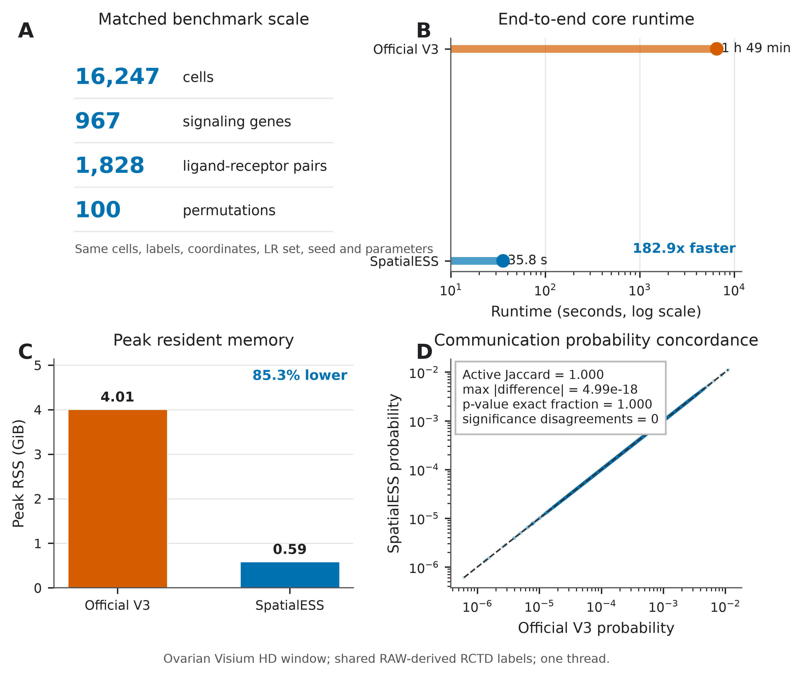
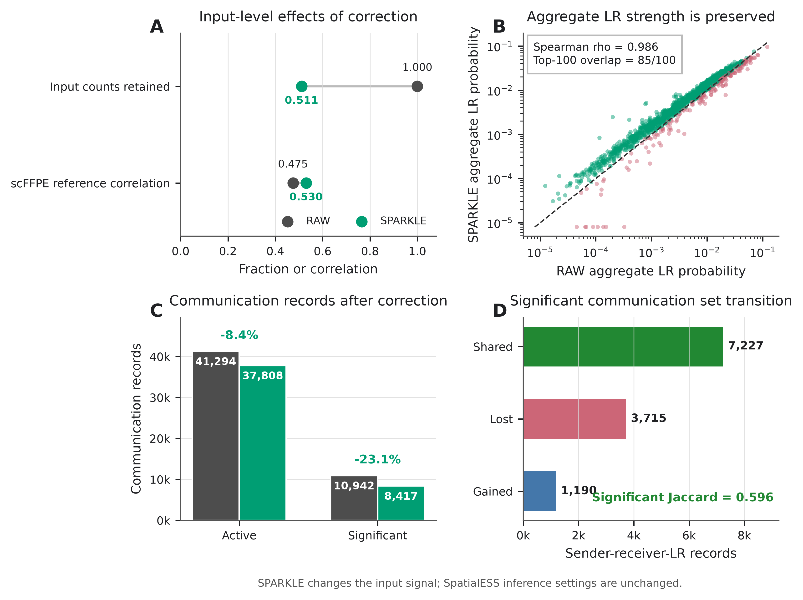

# SpatialESS + SPARKLE

A reproducible bridge from SPARKLE-corrected spatial expression to exact,
memory-efficient SpatialESS communication inference.

SpatialESS is the inference engine in this repository. SPARKLE is an
independent upstream method for evidence-constrained correction of local RNA
leakage. This project integrates the two tools without claiming the SPARKLE
correction model as a SpatialESS contribution.

## What this repository provides

- `spatialess_from_h5ad()`: one-call conversion and SpatialESS inference.
- Sparse, chunked H5AD export without densifying the complete matrix in R.
- Cell labels and coordinates from H5AD `obs` or an external metadata TSV.
- CP10K library-size calculation over all H5AD genes before signaling-gene
  selection.
- The SpatialESS engine is bundled in this repository and installed locally before the bridge package.
- A 24-cell executable example and regression tests.
- Compact source tables and scripts for two publication figures.

SPARKLE does not assign cell types. SpatialESS requires a group label for each
cell. Users can provide an existing annotation or generate one with an
appropriate reference and annotation workflow.

## Method boundary

```text
Raw spatial data + segmentation/out-of-mask evidence
                 |
                 v
       SPARKLE (external software)
                 |
                 v
     corrected sparse H5AD expression
                 |
                 v
 SpatialESSSPARKLE H5AD bridge
  - align cells, labels and coordinates
  - compute all-gene CP10K denominators
  - export only required signaling genes
                 |
                 v
 SpatialESS inference
  - CSR radius graph
  - streamed LR and permutation computation
                 |
                 v
 sender-receiver-LR probabilities and p-values
```

The ovarian scFFPE reference and its official barcode annotation used in the
validation study are tissue-matched benchmark resources. They are not required
for users whose H5AD already contains cell-type labels.

## Installation

A C++17 compiler, R >= 4.1 and Python >= 3.9 are required. The validated SpatialESS engine is bundled in this repository and installed locally by the setup script.

```bash
git clone https://github.com/Blake-Deng/SpatialESS-SPARKLE.git
cd SpatialESS-SPARKLE

conda env create -f environment.yml
conda activate spatialess-sparkle
Rscript scripts/install.R .
```

The environment provides the Python dependencies for the H5AD bridge. SPARKLE itself is an upstream tool and is run before this package. CellChat is optional for
the minimal example, but is required when using `CellChatDB.human` and automatic
database gene extraction.

## Minimal reproducible example

```bash
PYTHON="$(command -v python)" \
RSCRIPT="$(command -v Rscript)" \
./examples/minimal/run_demo.sh
```

The example creates a sparse SPARKLE-like H5AD, converts it, runs one synthetic
LR pair with ten deterministic permutations, and writes:

```text
examples/minimal/output/demo_records.tsv
examples/minimal/output/demo_result.rds
```

## One-command analysis

When `cell_type`, `x_um` and `y_um` are already present in H5AD `obs`:

```bash
Rscript scripts/run_spatialess_from_h5ad.R \
  corrected.h5ad cell_type x_um y_um spatialess_result.rds
```

The command uses `CellChatDB.human`, 100 permutations and seed 1. For explicit
control over the database and SpatialESS parameters, use the R API:

```r
library(CellChat)
library(SpatialESSSPARKLE)

data(CellChatDB.human, package = "CellChat")

result <- spatialess_from_h5ad(
  h5ad = "corrected.h5ad",
  group_col = "cell_type",
  coordinate_cols = c("x_um", "y_um"),
  lr = CellChatDB.human$interaction,
  complex = CellChatDB.human$complex,
  cofactor = CellChatDB.human$cofactor,
  normalization = "log1p_cp10k",
  nboot = 100L,
  seed.use = 1L
)

head(result$records)
result$bridge
```

## External annotation

If labels or coordinates are not stored in H5AD, provide a tab-separated file:

```text
cell    shared_cell_type    x_um    y_um
cell_1  Fibroblast          120.3   88.1
cell_2  Macrophage          126.8   91.4
```

```r
result <- spatialess_from_h5ad(
  h5ad = "corrected.h5ad",
  metadata_file = "annotation.tsv",
  cell_col = "cell",
  group_col = "shared_cell_type",
  coordinate_cols = c("x_um", "y_um"),
  lr = CellChatDB.human$interaction,
  complex = CellChatDB.human$complex,
  cofactor = CellChatDB.human$cofactor,
  nboot = 100L,
  seed.use = 1L
)
```

Every H5AD cell must occur exactly once in the metadata. The bridge restores the
H5AD cell order and fails on missing labels, duplicate identifiers, non-finite
coordinates or unresolved matrix dimensions.

## Input assumptions

- Use `normalization = "log1p_cp10k"` only when the selected H5AD matrix or
  layer contains non-negative count-scale values.
- Use `normalization = "none"` when the matrix has already received the intended
  normalization.
- Coordinate units must match `interaction.range`, `contact.range`, `tol` and
  `scale.distance`.
- Cell-type annotation must be biologically appropriate and consistent across
  samples; this package does not infer it.
- SPARKLE requires its own platform-specific segmentation and out-of-mask
  evidence. Follow the upstream SPARKLE documentation before running this
  bridge.

## Validation

The recorded ovarian Visium HD analysis used one SPARKLE-corrected input,
16,247 cells, 967 signaling genes, 1,828 computable LR pairs, 100 permutations,
identical labels, coordinates, seed and parameters, and one thread.

| Method | Core time | Process wall | Peak RSS | Active | Significant |
|---|---:|---:|---:|---:|---:|
| Official SpatialCellChat V3 | 6,541.848 s | 6,549.0 s | 4.008 GiB | 37,808 | 8,417 |
| SpatialESS | 35.765 s | 40.6 s | 0.590 GiB | 37,808 | 8,417 |

Numerical fidelity on the common SPARKLE input:

- active-record Jaccard: `1.000`;
- maximum absolute probability difference: `4.99e-18`;
- exact p-value fraction: `1.000`;
- significance disagreements at 0.05: `0`.



RAW and SPARKLE-corrected expression were also analyzed with identical
SpatialESS settings. Aggregate LR strength remained highly concordant
(Spearman rho `0.986`; top-100 LR overlap `85/100`), while the significant
sender-receiver-LR set changed (Jaccard `0.596`). This is an input-correction
effect, not an implementation discrepancy.



See [the validation notes](docs/VALIDATION.md) for interpretation boundaries and
[the benchmark directory](benchmark/ovarian_20260904/) for source tables.

## Reproduce the figures

```bash
python scripts/make_publication_figures.py
```

PDF and SVG versions are included for manuscript editing. The repository does
not include the large ovarian H5AD or raw 10x files.

## Repository layout

```text
R/                         R bridge API
inst/python/               backed H5AD converter
SpatialESS                  separately installed inference engine
examples/minimal/          executable small example
benchmark/                 compact validation source tables
figures/                   PDF, SVG and 450-dpi PNG outputs
docs/                      validation and attribution notes
```

## Scope of claims

The official comparison establishes numerical fidelity for the tested
SpatialCellChat V3 workflow and parameterization. RAW-versus-SPARKLE results
show that the integration carries corrected expression into SpatialESS
reproducibly. They do not by themselves prove that leakage correction improves
biological truth in every tissue, platform or parameter setting.

## Attribution

SPARKLE is developed independently and distributed under the MIT License. The
validated integration used `stambient` 0.1.2 at commit
`e0855e11ce22d4e97fedeeaf5bdcfe94f79b3d78`. Users enabling SPARKLE correction
must cite the SPARKLE work. See [SPARKLE attribution](docs/SPARKLE_ATTRIBUTION.md).

This repository includes the GPL-3 SpatialESS implementation and is distributed
under GPL-3.
